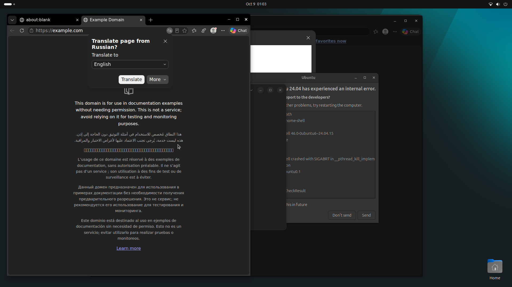

# edge-fex

Run the amd64 build of [Microsoft Edge](https://www.microsoft.com/edge) under
[FEX-Emu](https://github.com/FEX-Emu/FEX) on an arm64
[Arduino VENTUNO Q](https://docs.arduino.cc/hardware/ventuno-q/), then attach
[Playwright](https://playwright.dev/) to the browser for automated web
browsing.

It is slow. It is also useful. The point of this project is to get Edge
running on the board with a persistent, authenticated browser profile, not to
pretend that translated x86_64 Chromium is a fast way to browse the web.

I created a dedicated profile on this board, signed into my Microsoft account,
and signed into a handful of sites I want an agent to use. The profile stays on
the board. It is not in this repository.

The notes here are from the VENTUNO Q on October 8-9, 2026. The exact Edge and
FEX versions matter.

## Why

The VENTUNO Q is an arm64 board, while the useful existing browser automation
profile is based on the amd64 Linux build of Edge. FEX makes it possible to
run that build without replacing the board's userspace or asking Playwright
to drive a different browser.

This is a practical compromise. Translation adds latency and CPU use, Edge
needs `--no-sandbox` under the current FEX setup, and one run produced a FEX
SIGSEGV. I still want the browser running because a slow authenticated browser
is more useful here than a browser that cannot run at all.

## What works

The current launch path is:

```text
FEX /opt/microsoft/msedge/msedge \
  --browser-subprocess-path=/opt/microsoft/msedge/msedge \
  --no-sandbox \
  --test-type \
  --ozone-platform=wayland
```

This starts the amd64 Edge binary on the arm64 board. The browser renders
normal pages, the network service and renderer children stay alive, and
Playwright can attach to Edge through the Chrome DevTools Protocol (CDP).

The working path uses the GDM `Ubuntu on Wayland` session. Headed Edge survived
normal browsing, maximize/unmaximize, snapping, and resizing in that session
without a new `gnome-shell` crash report.

GPU acceleration works through FEX's EGL/OpenGL thunk. Chromium reported ANGLE
over EGL/OpenGL on the Adreno 623, with GPU compositing, rasterization, Canvas,
WebGL, and WebGPU enabled. Do not add `--disable-gpu` to the working Wayland
launcher.

The browser is still very very slow compared with native arm64 software. In a
15-second sample on a normal image-heavy page, the accelerated instance used
roughly 1.8 CPU cores. Memory remained below 2 GB, memory PSI stayed at zero,
and the hottest thermal zone stayed around 40-41 C.

This is Edge loading a page under FEX. The local account column and terminal
title are redacted:


This is the same browser at rest:


There is one screenshot already checked into the repository:



The redacted copies above came from `$HOME/Pictures/Screenshots/` on the board.
The original captures stay local because screenshots of an authenticated
browser can contain account names, page contents, private URLs, or other
browser state.

## Observed setup

The setup that produced these results was:

- Arduino VENTUNO Q, identified by `arduino,monza`
- arm64 host kernel `6.8.0-1089-qcom`
- Ubuntu 24.04 rootfs named `Ubuntu_24_04_edge`
- `fex-emu-armv8.2` version `2610-1`
- FEX binfmt handlers registered for x86 and x86_64
- `microsoft-edge-stable` version `155.0.4283.45-1`, amd64
- .NET `11.0.100-rc.1` installed on the host at `/usr/share/dotnet`
- a 7.5 GB `/dev/shm` tmpfs

Check the local versions before debugging a new board or rootfs:

```bash
$ uname -m
$ dpkg-query -W -f='${Package} ${Version} ${Architecture}\n' fex-emu-armv8.2
$ ROOTFS=$(sed -n 's/.*"RootFS": "\([^"]*\)".*/\1/p' "$HOME/.fex-emu/Config.json")
$ file "$ROOTFS/opt/microsoft/msedge/msedge"
$ awk 'BEGIN{RS=""} /Package: microsoft-edge-stable/' "$ROOTFS/var/lib/dpkg/status" \
    | grep -E '^(Package|Version|Architecture):'
$ echo "$XDG_SESSION_TYPE"
$ echo "$WAYLAND_DISPLAY"
$ df -h /dev/shm
```

The host should report `aarch64`, while the Edge binary should report `x86-64`
and the package should report `amd64`. Edge is installed inside the FEX rootfs,
not the host filesystem.

## How this works

There are three layers:

1. The VENTUNO Q runs an arm64 Linux userspace.
2. FEX translates the amd64 Edge executable and its child processes.
3. Edge uses the host Wayland compositor and host graphics stack through FEX's
   library thunks.

The rootfs contains the Edge installation at:

```text
/opt/microsoft/msedge/msedge
```

That path exists inside the rootfs. It does not exist as
`/opt/microsoft/msedge/msedge` in the host filesystem.

The repository scripts run that binary through `FEX`, put it in a user
systemd scope, cap its memory, and write the browser output to `logs/`.

You can confirm that a translated Edge helper is running without touching the
browser:

```bash
$ for pid in $(pgrep -f msedge_crashpad_handler); do
    printf '%s ' "$pid"
    readlink "/proc/$pid/exe"
  done
```

On this board the executable behind those x86_64 Edge helpers is
`/usr/bin/FEX`. The helper command line still names
`/opt/microsoft/msedge/msedge_crashpad_handler`.

### The child-process workaround

Chromium normally re-executes `/proc/self/exe` for the network service, GPU
process, zygote, and renderer children. Under this FEX setup, that path can
fall through to the rootfs `/bin/sh`. `dash` then tries to parse the FEX ELF
binary as a shell script and reports:

```text
/proc/self/exe: 1: Syntax error: ")" unexpected
```

Pass the real Edge path explicitly:

```text
--browser-subprocess-path=/opt/microsoft/msedge/msedge
```

Without that option, the parent process can appear to start while the network
and GPU children crash in a loop.

### The sandbox workaround

`--no-sandbox` is required on this FEX setup because the Edge zygote exits
during sandbox setup. `--test-type` hides the persistent warning banner caused
by `--no-sandbox`.

This is a local experimental setup. Do not treat it as a secure general
purpose browser or expose its debugging socket to a network.

### Wayland instead of X11

Use the GDM `Ubuntu on Wayland` session:

```bash
$ echo "$XDG_SESSION_TYPE"
wayland
```

The launcher adds `--ozone-platform=wayland` when `WAYLAND_DISPLAY` is set.
The Wayland path avoids the X11 launch path associated with the observed
`gnome-shell` SIGABRT in `meta_window_unmaximize()`.

That does not prove Edge caused the compositor crash. The X11 session produced
the crash report, while the Wayland session survived the same basic window
operations. I suspect the X11 maximize/unmaximize path, however I have not
proved it.

## Steps to replicate

These are the steps used on the VENTUNO Q.

1. Install FEX on the arm64 host and configure an Ubuntu 24.04 rootfs in
   `$HOME/.fex-emu/Config.json`.
2. Install the amd64 `microsoft-edge-stable` package inside that rootfs.
3. Confirm that the `FEX-x86` and `FEX-x86_64` binfmt handlers are enabled.
4. Start a GDM `Ubuntu on Wayland` session and check that
   `$XDG_SESSION_TYPE` is `wayland`.
5. Run `./scripts/monitor.sh` in one terminal.
6. Run `./scripts/run-edge.sh` in another terminal.
7. Check that Edge opens and that the network and renderer processes remain
   alive.
8. Test a simple page, then test maximize, unmaximize, snapping, and resizing.
9. Create the dedicated profile described below.
10. Close headed Edge, start the same profile with `--headless=new` and CDP
   enabled, and attach Playwright.

The repository starts after FEX, the rootfs, and Edge are installed. The exact
provisioning commands were not captured here, so verify the package and binary
state with the commands in `Observed setup` rather than guessing that a newer
rootfs is equivalent.

The scripts are the important part of the setup:

- [`scripts/run-edge.sh`](scripts/run-edge.sh) starts Edge in a memory-capped
  systemd scope and stops it if memory or temperature becomes unsafe.
- [`scripts/microsoft-edge-wrapper.sh`](scripts/microsoft-edge-wrapper.sh)
  provides the same Edge arguments without the watchdog loop.
- [`scripts/monitor.sh`](scripts/monitor.sh) records board health once a
  second, including memory PSI and temperature.

Do not replace these with a plain `FEX msedge` command until the child-process
workaround and the memory limits are understood.

## Run Edge

Run the watchdog launcher:

```bash
$ ./scripts/run-edge.sh
```

The launcher:

- runs `/opt/microsoft/msedge/msedge` through `FEX`
- adds the child-process, sandbox, first-run, and Wayland arguments
- places Edge in a user systemd scope
- caps the scope at `MEM_CAP`, which defaults to `6G`
- stops the scope if available memory drops below `MIN_MB`, default `1500`
- stops the scope if the hottest thermal zone reaches `MAX_C`, default `90`
- writes stdout and stderr to a timestamped file under `logs/`

Override the watchdog values when testing:

```bash
$ MIN_MB=2000 MAX_C=85 MEM_CAP=6G ./scripts/run-edge.sh
```

Pass additional Edge arguments after the script:

```bash
$ ./scripts/run-edge.sh --no-first-run about:blank
```

The simpler wrapper uses an 8 GB memory cap and does not run the watchdog:

```bash
$ ./scripts/microsoft-edge-wrapper.sh
```

For a quick headless smoke test:

```bash
$ ./scripts/run-edge.sh \
    --headless=new \
    --dump-dom \
    about:blank
```

The earlier tests also returned exit code 0 for `about:blank` and
`https://example.com` with the child-process workaround. `--single-process`
is not a substitute. It led to a crashpad ptrace failure and exit code 139.

## Create the authenticated profile

Use a dedicated Edge profile. Do not use the normal daily profile, and do not
put the profile in this repository. The profile contains cookies, local
storage, tokens, history, and other browser state.

Choose a local path outside the checkout:

```bash
$ export EDGE_PROFILE="$HOME/.config/edge-fex-playwright"
$ mkdir -p "$EDGE_PROFILE"
```

Start headed Edge with the dedicated profile and the default loopback CDP
endpoint:

```bash
$ ./scripts/run-edge.sh \
    --user-data-dir="$EDGE_PROFILE" \
    --remote-debugging-port=9333
```

Sign into the Microsoft account in the Edge window, then sign into the small
set of sites that the agent is approved to use. Complete any multi-factor
authentication prompts in the headed browser. Do not copy passwords, recovery
codes, cookies, account names, site names, or CDP URLs into this repository.

The profile is the authenticated state. Close Edge cleanly after the sign-in
session finishes, then use the same `EDGE_PROFILE` for the headless launch.
The profile on this board has completed that headed sign-in step.

Raw Chromium logs can contain debugging endpoints, authentication service
URLs, page URLs, and profile paths. Review every log before committing it. The
checked-in run logs redact the DevTools address and remove verbose
authentication diagnostics, and the checked-in screenshots redact the local
account name. The public
`example.com` smoke test remains in the logs because it is the documented test
case, not private browsing history.

## Run headless Edge for Playwright

Start the same profile without a visible browser window:

```bash
$ ./scripts/run-edge.sh \
    --headless=new \
    --user-data-dir="$EDGE_PROFILE" \
    --remote-debugging-port=9333
```

Do not start two Edge instances against the same profile at the same time.
Edge locks the profile, and concurrent writers can corrupt browser state.

The CDP endpoint is intentionally bound to `localhost`. Do not replace that
with a LAN address or forward the port outside the board. Anyone who can reach
the DevTools endpoint can generally drive the authenticated browser.

Check that the endpoint answers from the board without printing the browser
WebSocket URL into a shared log:

```bash
$ curl --silent http://localhost:9333/json/version | sed \
    -E 's#("webSocketDebuggerUrl"[[:space:]]*:[[:space:]]*")[^"]+#\1<redacted>#'
```

If the command returns JSON containing a browser version and a redacted
`webSocketDebuggerUrl`, Edge is ready for Playwright.

## Use Playwright over CDP

Install Playwright Core in the agent's own project, not in the Edge rootfs:

```bash
$ npm install playwright-core
```

Attach to the already-running browser:

```javascript
const { chromium } = require("playwright-core");

const browser = await chromium.connectOverCDP("http://localhost:9333");
const [context] = browser.contexts();
if (!context) {
  throw new Error("Edge did not expose the persistent profile context");
}
const page = context.pages()[0] || await context.newPage();

await page.goto("https://example.com", { waitUntil: "domcontentloaded" });
console.log(await page.title());
```

The first context is the profile loaded by Edge, so cookies and local storage
from the headed sign-in session are available to Playwright. Do not call
`browser.close()` if Edge should remain available for the next task. Ending the
agent process drops the CDP connection without asking Edge to shut down.

For a long-running agent, keep the browser lifecycle outside the page task:

1. Start Edge with the dedicated profile and CDP enabled.
2. Wait for `http://localhost:9333/json/version`.
3. Connect Playwright over CDP.
4. Reuse the existing context for browser tasks.
5. Close the connection when the task ends.
6. Stop the Edge systemd scope when no more tasks need the profile.

This is browser automation with an authenticated session. Treat every page,
download, form submission, and navigation as an action that needs an explicit
allowlist.

## Monitor the board

Start the one-second health logger before a long Edge run:

```bash
$ ./scripts/monitor.sh
```

Or choose a log file:

```bash
$ ./scripts/monitor.sh "$HOME/edge-fex/logs/monitor-wayland.log"
```

The monitor records load, available memory, swap, dirty pages, memory PSI,
thermal temperature, the number of FEX and Edge processes, and the largest
processes. It calls `sync` after each line so the tail is more likely to
survive a hard reset.

The Wayland GPU run stayed around 40-41 C, with memory PSI at zero and more
than 11 GB available memory during the recorded sample. That is a measurement
from this board, not a performance guarantee.

## Troubleshooting

### Edge starts, then the network service or GPU process dies

Check the launcher arguments:

```bash
$ ps -eo pid,comm,args | grep '[m]sedge'
```

The command line must contain:

```text
--browser-subprocess-path=/opt/microsoft/msedge/msedge
--no-sandbox
```

The first option fixes the `/proc/self/exe` and shell-parser failure. The
second is required by the current FEX sandbox behavior.

### Edge opens a window and the board resets

Check `/var/crash` and the monitor log before blaming FEX. The earlier resets
were associated with an arm64 `gnome-shell` SIGABRT from a GLib assertion in
`meta_window_unmaximize()`, not a memory or thermal event from FEX.

Use the GDM Wayland session and native Wayland:

```bash
$ echo "$XDG_SESSION_TYPE"
$ ./scripts/run-edge.sh --ozone-platform=wayland
```

Then test maximize, unmaximize, snapping, and resizing one at a time while
watching the monitor log.

### CJK text renders as boxes

Install the missing CJK font package inside the Ubuntu 24.04 Edge rootfs:

```bash
$ sudo apt install fonts-noto-cjk
```

The command must run against the rootfs that contains
`/opt/microsoft/msedge/msedge`, not an unrelated host userspace.

### Hardware video decode reports a VAAPI error

The logs contain a VAAPI initialization error and no video decode profiles.
The rest of the graphics path remains usable. GPU compositing, rasterization,
Canvas, WebGL, and WebGPU were enabled, so do not disable the whole GPU path
just to hide the video decode warning.

### `--single-process` crashes

Do not use it as a workaround. The recorded run failed in crashpad ptrace
setup and exited with code 139.

### Playwright cannot connect

Check the following:

1. Edge is still running with `--remote-debugging-port=9333`.
2. Playwright uses `http://localhost:9333`, not a stale WebSocket URL.
3. The profile is not locked by another Edge process.
4. The CDP endpoint is ready before Playwright connects.
5. The agent and Edge are on the same board or are using an explicitly
   protected local forwarding mechanism.

Do not bind CDP to all interfaces as a debugging shortcut.

## Known limitations

- FEX translation makes Edge noticeably slow, especially with several tabs or
  JavaScript-heavy pages.
- The current launch requires `--no-sandbox`, so this is not a hardened
  general-purpose browser deployment.
- One Edge process produced a FEX SIGSEGV. There is no useful stack trace yet.
- Hardware video decode is not working.
- CJK fonts are missing until `fonts-noto-cjk` is installed in the rootfs.
- GNOME still emitted nonfatal Wayland assertions about compositor surface
  configuration.
- The authenticated profile is private local state and is not part of this
  repository.
- The Edge, FEX, Ubuntu, kernel, and board versions in this document can drift.
  Recheck them before treating an old result as a regression.

## Repository layout

```text
edge-fex/
├── findings/                         # investigation notes and crash excerpts
├── logs/                             # sanitized browser and board logs
├── screenshots/                      # redacted performance captures
├── scripts/
│   ├── microsoft-edge-wrapper.sh     # simple scoped Edge launcher
│   ├── monitor.sh                    # one-second board health logger
│   └── run-edge.sh                   # watchdog launcher
├── LICENSE
└── README.md
```

The logs are evidence, not a substitute for reproducing the behavior. The
checked-in logs redact DevTools addresses and remove verbose authentication
diagnostics. They do not contain account names, private site names, private
page URLs, local account names, or browser profile contents.

## Additional Reading

- [FEX-Emu](https://github.com/FEX-Emu/FEX)
- [FEX Linux user documentation](https://wiki.fex-emu.com/index.php/Welcome)
- [Microsoft Edge for Linux](https://www.microsoft.com/edge/business/download)
- [Playwright documentation](https://playwright.dev/docs/intro)
- [Playwright connectOverCDP](https://playwright.dev/docs/api/class-browsertype#browser-type-connect-over-cdp)
- [Arduino VENTUNO Q](https://docs.arduino.cc/hardware/ventuno-q/)

The goal is simple: keep Edge running long enough for the agent to do useful
work. It does not need to be fast.

## License

MIT
